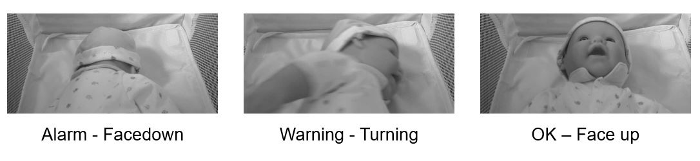

# CNN to Prevent SIDS

This is the code for the paper

**[An Efficient Convolutional Neural Network Computer Vision System to Prevent Sudden Infant Death Syndrome](https://engrxiv.org/wbx63/)** 
<br>
[Vivek S Bharati](mailto:viveksbharati@gmail.com)


The paper addresses the problem of **Sudden Infant Death Syndrome (SIDS)** that causes infants under one year of age to die inexplicably. One of the most important external factors responsible for the syndrome, called an ‘outside stressor’, is the sleeping position of the baby. When the baby sleeps on the stomach face-down, the risk of SIDS occurring is very high. A CNN model is capable of detecting the hazardous face-down sleeping position and alerting caregivers. Here is a sample of the sleeping positions captured by the camera and the classifications from the model. 




The model is a deep convolutional neural network trained in an end-to-end fashion. 

We provide:

- A [pretrained models](#pretrained-models)
- Code to run a [live demo with a webcam](#webcam-demo)
- Instructions for [training the model](#training)

If you find this code useful, please cite:

```
APA
Bharati, V. S. (2020, December 31). An Efficient Convolutional Neural Network Computer Vision System to Prevent Sudden Infant Death Syndrome. https://doi.org/10.31224/osf.io/wbx63
```

## Installation

The project is implemented in [Keras/Tensorflow v2.0.0] (https://keras.io/), and depends on the following packages: 
```bash
matplotlib v3.1.3
opencv-python v4.5.1.48 
numpy v1.19.2
pickle v0.7.5
boto3 v1.12.16
```

## Running the code

I have provided the code for the data preparation (data generation / resizing), training the model,  and running the model with the webcam as a Jupyter notebook. The code snippets within the notebook could be executed as independent python3 executables within an environment with the above packages installed. 

## Pretrained model

Pretrained models are provided within the models folder(directory). If a new model needs to be tried out, the model name (with folder) needs to be replaced within the notebook (section - Running the model).

## Training

The Jupyter notebook contains the code to train the model with a new data set.   The training data (images of babies that conform to different classifications) are to be placed in the stipulated folders. 
   
### Step 1:  Preparing the data - Generate Images

The code within the "Generate images" Juypter Notebook section extrapolates an existing set of images by introducing image transformations as explained in the paper. 

### Step 2:  Preparing the data - Images processing and pickling

The images are further processed - resized,converted to grayscale, and pickled - by the code within "Prepare and pickle data for repeated use" section

### Step 3:  Training the model

    Code for training the model is within the "Model Creation" section. This would also create logs that could be viewed with a tensorboard. The code would create multiple models based on the array elements specified in dense_layers, layer_sizes and conv_layers arrays
    
```bash
dense_layers =  [0] # [3, 4, 8]
layer_sizes =  [32] #[32, 64, 128]
conv_layers = [3] #[1, 2, 3]
```
The model with the best accuracy/smallest loss could be choosen

## Webcam demo

The webcam demo code is within the "Running the model" section of the notebook. This section should be modified to the model name (of the chosen model). To send out notifications, AWS SNS (simple notification service) is leveraged. This requires the aws_access_key_id and aws_secret_access_key for accessing AWS. A topic needs to be created on SNS and should be updated within TopicArn. The demo uses the default webcam of the machine that is running the demo


